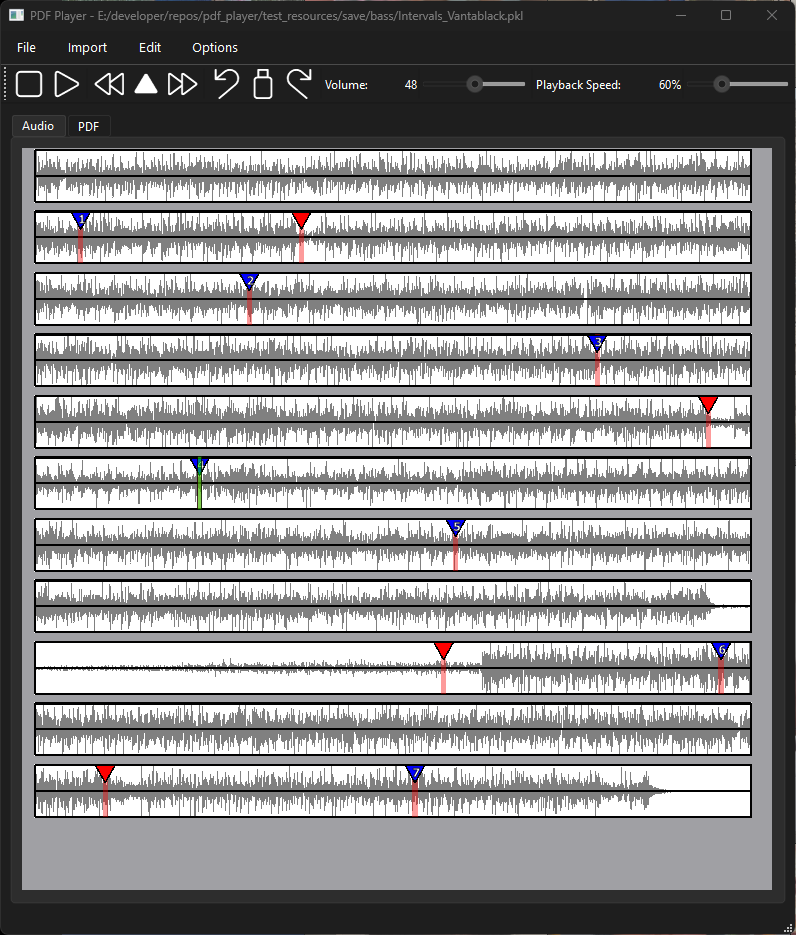
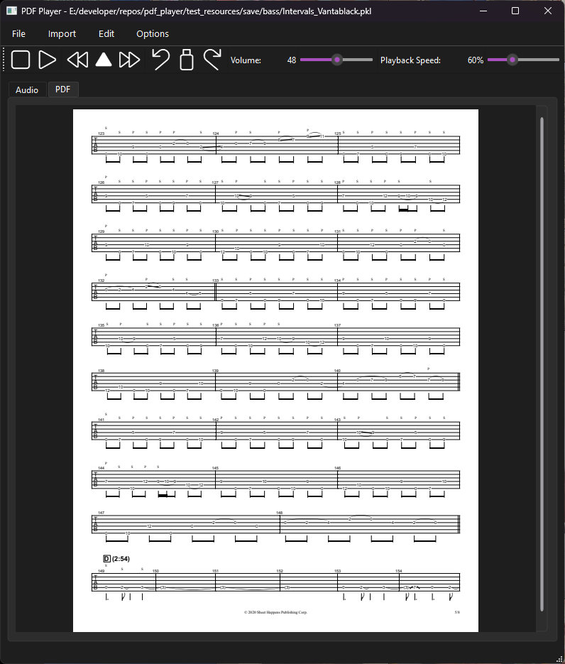

# PDF Player 
PDF Player is a music practice tool that allows you to sync sheet music with an audio recording. PDF Player also doubles as a slow player providing users a useful tool for practicing and learning music. 
 

<figure align="center">
  <figcaption><b>Audio Timeline Tab.</b> Blue markers represent page markers, while red markers represent practice markers.</figcaption>
  
</figure>
 

<figure align="center">
  <figcaption><b>PDF Viewer Tab.</b>  Pages can be navigated using Up/Down Arrow Keys.</figcaption>
  
</figure>
 

## How to add markers
Page markers must be placed on the Audio Timeline in order to synchronize audio with page turns.
Clicking on the Audio Timeline with one of the corresponding combinations will add/remove a marker:

| Key                     | Function              |
|-------------------------|-----------------------|
| Shift + Left Click      | Add Practice Marker   |
| Ctrl + Left Click       | Add Page Marker       |
| Ctrl + Left/Right Click | Remove Marker        | 

Practice markers are used to navigate to set locations within the Audio Timeline.
You can navigate to different markers using the following keys:

| Key                 | Function               |
|---------------------|------------------------|
| Right/Forward Arrow | Next Practice Marker | 
| Left/Back Arrow     | Previous Practice Marker     | 
| Up Arrow            | Next Page Marker   |
| Down Arrow          | Previous Page Marker   | 

