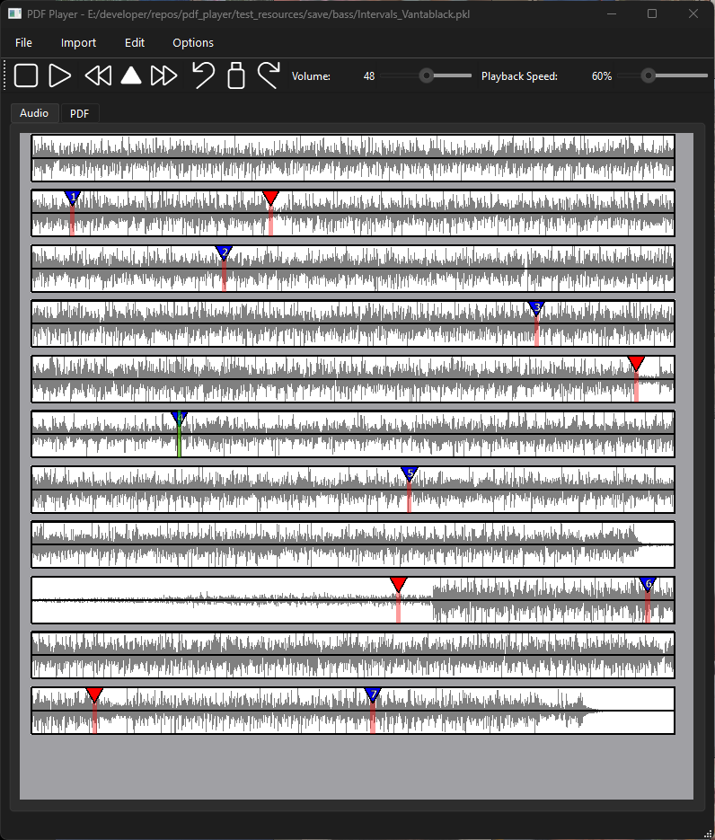
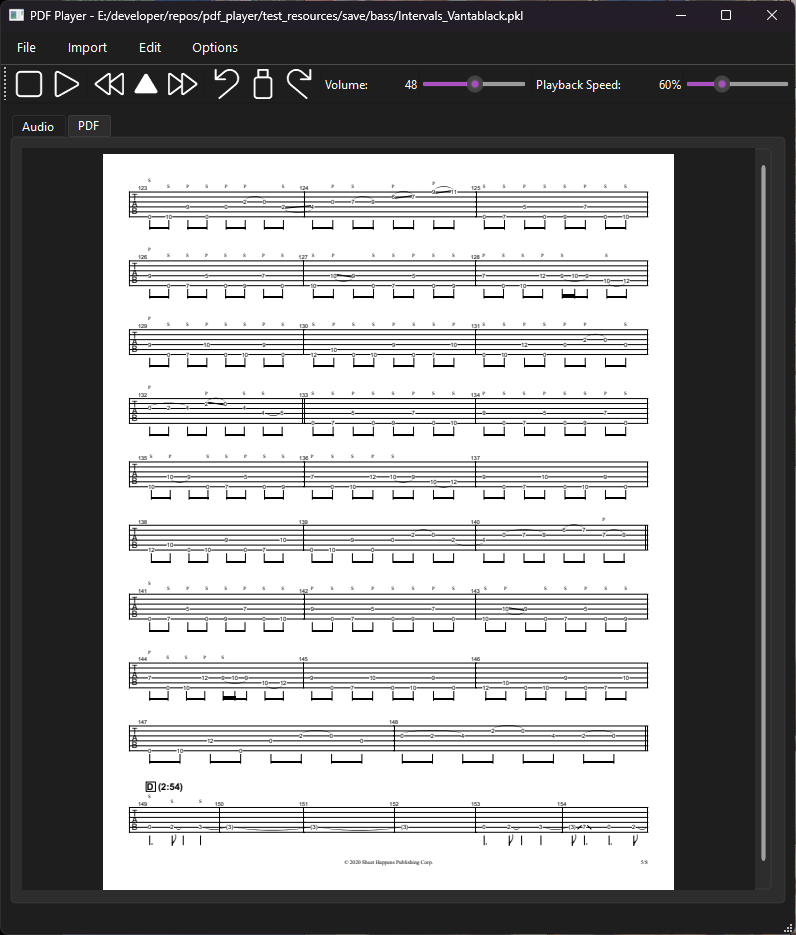

# PDF Player 
PDF Player is a music practice tool that allows you to sync sheet music with an audio recording. PDF Player also doubles as a slow player providing users a useful tool for practicing and learning music. 
<br>

<figure align="center">
  <figcaption><b>Audio Timeline Tab.</b><br>Blue markers represent page markers, while red markers represent practice markers.</figcaption>
  
</figure>
<br>

<figure align="center">
  <figcaption><b>PDF Viewer Tab.</b><br> Pages can be navigated using Up/Down Arrow Keys.</figcaption>
  
</figure>
<br>

## Download
Windows builds are attached to each [GitHub Release](https://github.com/funnydogeatapepsi/pdf_player/releases)
(built automatically by GitHub Actions from `build/pdf_player.spec`). To run from source:

```
pip install -r requirements.txt
python main.py
```

## Page offset
If your PDF has leading pages (cover, table of contents, ...), set the **page offset** in *Options → Project Options*
or hold **Ctrl** and scroll the mouse wheel over the PDF tab. The offset is the page shown before the first page
marker; page marker *k* then turns to page `offset + k`. The offset is saved with the project.

## Project files
Projects are saved as `.json` files (audio/PDF paths, marker positions, page offset). Older `.pkl` projects
still open; the next save writes a `.json` next to them.

## Slow-down method
*Options → Project Options* also lets you pick the time-stretch algorithm used by the playback speed slider:
**WSOLA** (default — overlap-add with waveform alignment, no wobble), **Overlap-Add** (fastest), or
**Phase Vocoder**. This setting applies to all projects. Processing runs in the background — the status bar
shows *Processing audio...* and playback switches over when it is done, keeping your position.

## Metronome
Press **M** to enter *metronome edit mode*: page/practice markers are hidden and the timeline shows only the
green **tempo markers** and the beat grid they define (tall ticks on downbeats). Add tempo markers with
**Shift + Click**, edit one with **Right Click**, and remove one with **Ctrl/Shift + Right Click** (full list under
[Shortcuts](#shortcuts)).

Each tempo marker holds until the next one, so tempo and time-signature changes are just more markers.
**Ctrl+M** toggles the click track (level in *Options → Project Options*); the toolbar shows the current bar and
beat. Clicks are rendered into the audio, so they stay locked to the music at any playback speed.

## Markers
There are two kinds of marker on the Audio Timeline:

- **Page markers** (blue, numbered) turn the PDF to the next page. Place one wherever a page turn happens.
- **Practice markers** (red) are bookmarks you can jump between with the arrow keys.

When you jump backward while playing, playback starts 0.5 s before the marker, so pressing the key again quickly
takes you to the marker before that one. Pressing it after that half second restarts the current section instead.

## Shortcuts

### Playback and navigation
| Shortcut        | Action                                   |
|-----------------|------------------------------------------|
| Space           | Play / pause                             |
| Right Arrow     | Jump to the next practice marker         |
| Left Arrow      | Jump to the previous practice marker     |
| Up Arrow        | Jump to the next page marker (next page) |
| Down Arrow      | Jump to the previous page marker         |
| Click / drag on the timeline | Move the playback position  |

### Adding, moving and removing markers
| Shortcut                          | Action                                                   |
|-----------------------------------|----------------------------------------------------------|
| Shift + Click on the timeline     | Add a practice marker there                              |
| Ctrl + Click on the timeline      | Add a page marker there                                  |
| Shift + Space                     | Add a practice marker at the playback position           |
| Ctrl + Space                      | Add a page marker at the playback position               |
| Hold A + drag a marker            | Move it                                                  |
| Ctrl + Right Click or Shift + Right Click on a marker | Remove it                            |
| Alt + Right Arrow / Alt + Left Arrow | Remove the next / previous practice marker            |
| Alt + Up Arrow / Alt + Down Arrow | Remove the next / previous page marker                   |
| Shift + Delete                    | Remove all markers                                       |

Shift + Click or Ctrl + Click on the empty area around the timeline lines adds the marker at the playback position
instead of where you clicked.

### Metronome
| Shortcut                          | Action                                                   |
|-----------------------------------|----------------------------------------------------------|
| M                                 | Turn metronome edit mode on / off                        |
| Ctrl + M                          | Turn the metronome click on / off                        |
| Shift + Click / Shift + Space     | Add a tempo marker (in metronome edit mode)              |
| Right Click on a tempo marker     | Edit its tempo and beats per bar (in metronome edit mode)|

In metronome edit mode, Ctrl + Click and Ctrl + Space don't add page markers; moving and removing work the same
as for other markers.

### View
| Shortcut                          | Action                                                   |
|-----------------------------------|----------------------------------------------------------|
| F                                 | Fullscreen on / off                                      |
| Ctrl + Scroll Wheel on the timeline | Zoom the timeline (1x to 16x)                          |
| Ctrl + Scroll Wheel on the PDF    | Change the page offset (scroll down = skip one more leading page) |

### Files
| Shortcut          | Action          |
|-------------------|-----------------|
| Ctrl + O          | Open project    |
| Ctrl + S          | Save project    |
| Ctrl + Shift + S  | Save project as |
| Ctrl + K          | Import audio    |
| Ctrl + I          | Import PDF      |
